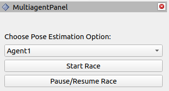

# Exploring Utilites

## Rviz Plugin

- You'll have a builtin Rviz Plugin waiting for you to start the race and optionally reset the poses of agents. When you click Start Race, the racecars will be spawned and they'll be ready to take drive messages from your racing algorithm